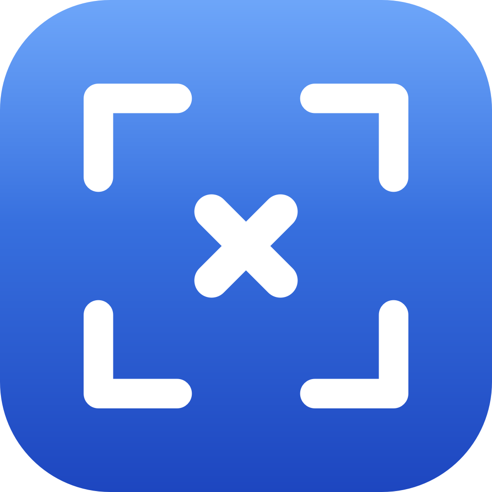

<div align="center">



# ShotX


**Modern macOS screen capture for the menu bar.**
Screenshots, screen recording with webcam overlay, GIF export, in-place annotation, color picker, OCR text extraction, and a searchable history — without ever leaving your keyboard.


[](https://github.com/aimen08/shotx/releases/latest)
[](https://buymeacoffee.com/aimen08)

[**↓ Download**](https://github.com/aimen08/shotx/releases/latest) · [Features](#features) · [Install](#install) · [Support](#support)

</div>

---

## Features

- **Screenshots** — region, window, fullscreen, previous area; self-timer (3 / 5 / 10 s); open any image from clipboard or file
- **Screen recording** — H.264 MP4 or GIF (12 fps, 720 px) via ScreenCaptureKit, with microphone, system audio, and click highlights
- **Webcam overlay** — circular self-view in the bottom-left of the recording region; drag to reposition and resize during preview, baked into the final video
- **Annotate** — arrows, rectangles, text, numbered steps; 8-color palette; copy or save in one keystroke
- **Extract text (OCR)** — drag a region, Apple Vision recognizes the text, and it lands on your clipboard
- **History** — last 100 captures on disk, searchable, with thumbnails
- **Color picker** — native loupe, hex copied to clipboard
- **Pin, drag-out, auto-updates** — float screenshots on top, drag into any app, Sparkle-signed updates
- **Configurable global shortcuts** — re-register live, no restart

---

## Default shortcuts

| Action                  | Shortcut |
|-------------------------|----------|
| Capture region          | `⌥X`     |
| Capture fullscreen      | `⌥⇧X`    |
| Extract text (OCR)      | `⌥⇧T`    |
| Pick color              | `⌥⇧C`    |
| Stop recording          | `⌘.`     |
| Open from clipboard     | `⇧⌘V`    |
| Settings                | `⌘,`     |
| Quit                    | `⌘Q`     |

All four global shortcuts are configurable in **Settings → Shortcuts**.

---

## Install

1. Download the latest **`ShotX-x.y.dmg`** from [Releases](https://github.com/aimen08/shotx/releases/latest)
2. Drag **ShotX.app** to **Applications**
3. **Right-click → Open** on first launch (Gatekeeper warning, the app is ad-hoc signed)
4. Grant **Screen Recording** permission, then quit and re-open ShotX once

> Requires macOS 13.0 or later.

---

## Build from source

Needs Swift 5.9 + macOS 13 SDK (Xcode 15+).

```bash
git clone git@github.com:aimen08/shotx.git
cd shotx

swift run                             # run in dev
./Scripts/build-app.sh                # bundle .app
./Scripts/make-dmg.sh                 # bundle DMG installer
./Scripts/release.sh                  # build + tag + GitHub release
```

**Stable permissions:** create a self-signed *Code Signing* cert in Keychain Access and save its name to `.signing-identity`. Builds sign with it, so Screen Recording permission persists across updates.

**Auto-updates (Sparkle):** run `./Scripts/sparkle-setup.sh` once to generate an Ed25519 key; `release.sh` then signs each DMG and appends to `appcast.xml` automatically.

---

## Website

The marketing site lives in `website/` (Vite + React, Netlify-ready):

```bash
cd website && npm install && npm run dev
```

---

## Roadmap

- [ ] Keystroke visualization in recordings
- [ ] Scrolling capture (stitched long-form screenshots)
- [ ] Notarized / Developer ID-signed distribution

---

## Support

ShotX is free and open source. If it saves you some time, you can keep it fueled:

<p><a href="https://buymeacoffee.com/aimen08"></a></p>

Every coffee helps keep new features, bug fixes, and auto-update infra running.

---

<div align="center">
<sub>Built with Swift, AppKit, SwiftUI, and Claude.</sub>
</div>
